# Classéo, main flows

For engineers who need to know what happens, in which order and where, for
the journeys that cross several modules. Each diagram was checked step by
step against the files it cites. UI terms are quoted in French, as users see
them.

Common to every write: server actions go through `createAction`
(`src/lib/action.ts`), which reads the session, checks the permission code,
refuses a temporary password and validates the input with zod before the
handler runs. The handler scopes its queries (`src/lib/auth/scope.ts`),
calls `assertWritable` (`src/lib/guards.ts`) to refuse a closed year or a
suspended school, writes, audits (`src/lib/audit.ts`) and notifies
(`src/lib/notify.ts`). The diagrams show these steps only where they matter.
The HTTP routes are described in [api/openapi.yaml](api/openapi.yaml), the
server actions in [api/README.md](api/README.md).

## Contents

1. [Sign in and session](#1-sign-in-and-session)
2. [Password help up the hierarchy](#2-password-help-up-the-hierarchy)
3. [Grade entry and report card publication](#3-grade-entry-and-report-card-publication)
4. [Offline entry and replay](#4-offline-entry-and-replay)
5. [Online payment with FedaPay](#5-online-payment-with-fedapay)
6. [Payment declaration and confirmation](#6-payment-declaration-and-confirmation)
7. [Document issue and QR verification](#7-document-issue-and-qr-verification)
8. [Transfer between schools with parent consent](#8-transfer-between-schools-with-parent-consent)
9. [Mock exam invitation and approval](#9-mock-exam-invitation-and-approval)
10. [Translation and voice](#10-translation-and-voice)
11. [Voice notes and family pieces](#11-voice-notes-and-family-pieces)

## 1. Sign in and session

The sign in form accepts the identifier generated from the names
(`adjoa.houngbedji`) or, for accounts that have one, the e-mail address.
Two fixed window limits run first: 30 attempts per client address and 10 per
identifier in 15 minutes. The address limit only applies when the address is
trusted (Vercel, or `TRUST_PROXY=true`); otherwise every request shares the
key `direct` and only the identifier limit applies. Five wrong passwords lock
the account for 15 minutes. An unknown identifier gets the same message and
the same password hashing time (`dummyVerify`) as a wrong password, and
reports "locked" after the same number of attempts, so the answer never tells
whether an account exists.

The session is a row in `Session` plus an httpOnly, SameSite=Lax cookie
`classeo_session` holding an HS256 JWT with the session id, valid eight
hours. Every page, action and route loads the session row and refuses it when
revoked, expired or when the account is disabled. `src/proxy.ts` only
redirects requests to `/espace/*` without the cookie; it checks nothing else.

Files: `src/features/auth/actions.ts` (`login`, `logout`,
`changePassword`), `src/lib/auth/session.ts`, `src/lib/auth/password.ts`,
`src/lib/rate-limit.ts`, `src/proxy.ts`.

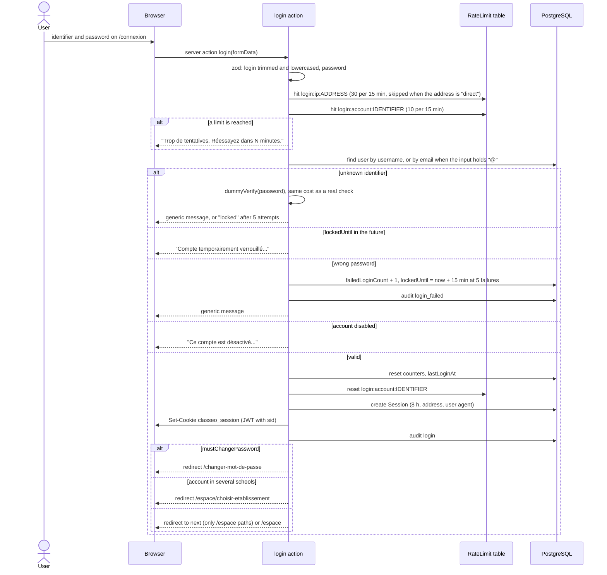

## 2. Password help up the hierarchy

A person who cannot sign in and has no e-mail asks for help from
"Mot de passe oublié". The request goes to the level that manages the
account (`helpRouteLevel`): pupils, parents and school staff to their school
head; heads of nursery and primary schools to the circonscription; heads of
secondary schools to the DDESTFP (the secondary chain has no
circonscription); chefs de circonscription to the departmental direction;
departmental and national agents to the ministry. The public answer is the
same whether the identifier exists or not, and nothing is written before it:
the request is filed after the response. One pending request per account;
asking again only updates the number to call back.

The handler resets the password to a temporary one, which the account must
change at its next sign in. Between peers of the same level, the anti
escalation rule applies: a handler cannot reset an account holding rights it
does not hold.

Files: `src/features/password-help/actions.ts`,
`src/features/password-help/routing.ts` (unit tested),
`src/features/password-help/queries.ts` (`handlerIds`,
`helpRequestWhere`), page `/espace/aide-connexion`.

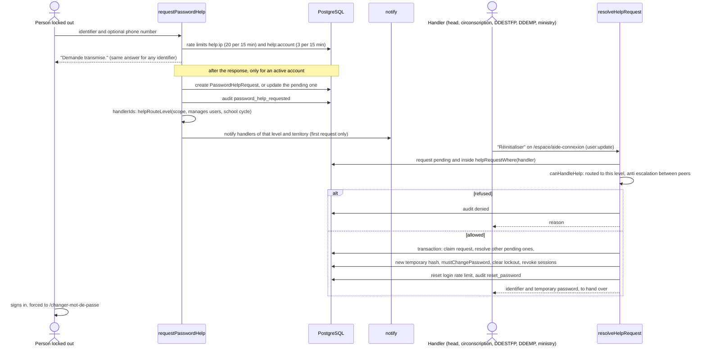

## 3. Grade entry and report card publication

A grade sheet belongs to one course assignment (class and subject) and one
period. Periods follow the school's periodicity: two semesters in public
secondary and technical schools, three trimesters elsewhere, overridable per
school by the ministry (`src/lib/domain/periodicity.ts`). A sheet can only be
created for a period of that periodicity. The default formula is
`OFFICIAL_2024` (MESTFP order n° 029 of 6 May 2024, article 59): the average
of the interrogations counts as one mark and each devoir as one mark,
compositions ignored. Composition based formulas are offered only to schools
that enabled compositions (`sheetConfigError`).

The entry grid sends only changed cells; an empty cell deletes the grade.
A locked sheet or a closed period refuses writes. Publication computes every
report card of the class from the grades (averages, coefficients, ranks with
ties), writes one snapshot per student (republishing replaces it) and
notifies guardians and students.

Files: `src/features/grades/actions.ts`, `src/features/grades/components/grade-grid.tsx`,
`src/lib/domain/grades.ts`, `src/lib/domain/grade-entry.ts`,
`src/lib/domain/report-card.ts`, `src/features/report-cards/compute.ts`,
`src/features/report-cards/actions.ts`.

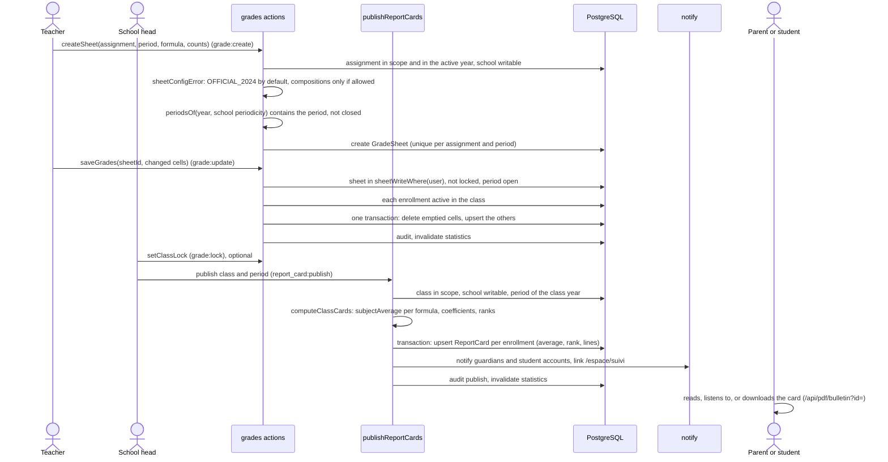

## 4. Offline entry and replay

Grades, attendance and text messages can be typed without network. The page
first tries the online server action; when the browser is offline, or the
action cannot reach the server, the entry goes to an IndexedDB queue on the
device, owned by the signed in account. Each entry carries a `clientId`
(UUID made on the device when the user pressed save), the payload of the
online action, and a `baseline`: the values the page had read before the
user typed. The same `clientId` travels with the online attempt, so a request
that reached the server before the connection dropped is never written
twice.

When the network returns, the open page replays the queue, oldest first,
through `POST /api/offline/replay`; with no page open, the service worker's
Background Sync does it. The server writes a value typed offline only if the
target did not change since the device read it; otherwise it refuses the
entry, keeps the newer server value and names the students concerned. The
device then shows the conflict ("Saisie refusée...") and keeps the typed
values in "À revoir" for the user to compare and resend. Signing out seals
the queue: entries stay on the device and are replayed only when the same
account signs in again.

Files: `src/features/offline/client.ts` (`sendOrQueue`, `syncNow`),
`src/features/offline/queue.ts`, `src/features/offline/replay.ts`,
`src/features/offline/rules.ts` (conflict rules, unit tested),
`src/features/offline/submission.ts` (`withSubmission`),
`src/app/api/offline/replay/route.ts`, `public/sw.js` (`replayQueue`).

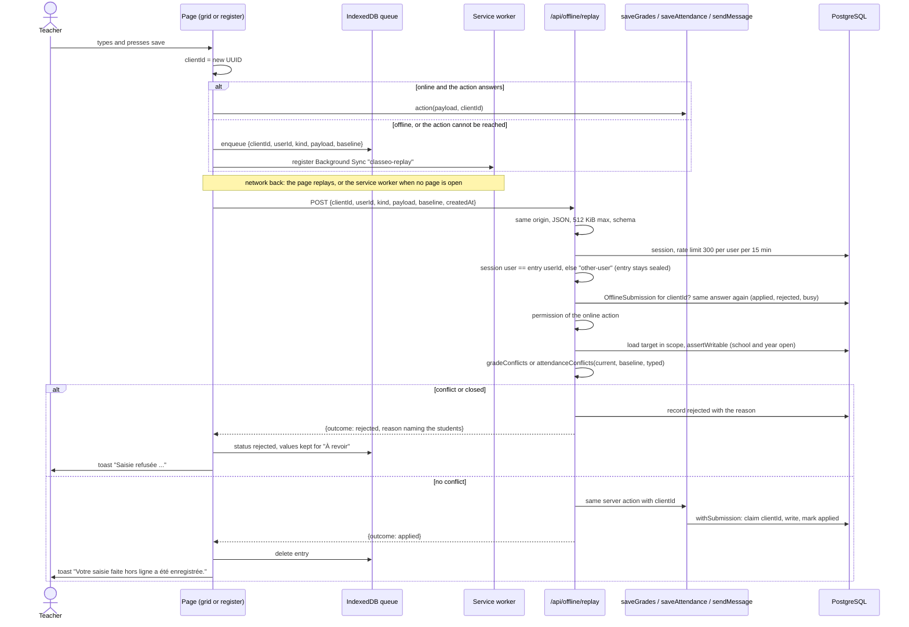

## 5. Online payment with FedaPay

A parent pays an invoice, or chosen installments, from "Payer". The amount
is computed on the server from the invoice, never read from the browser.
The server creates an `OnlinePayment` row, then a FedaPay transaction and its
payment link, and redirects the parent to FedaPay (MTN MoMo, Moov Money,
Celtiis Cash, cards). The result arrives by two paths: the signed webhook,
and the return page, which polls `/api/paiements/en-ligne/{id}` every four
seconds and makes the server ask FedaPay directly when nothing arrived for
ten seconds (a webhook cannot reach a local installation). Both paths apply
the provider state through `settleOnlinePayment`, which locks the row
(`SELECT ... FOR UPDATE`), so the payment is recorded once whatever the
number of deliveries. An amount or currency that differs from the request is
not recorded and is flagged for the accountant. The recorded payment gets a
receipt reference; the parent and the school's accountants are notified.

Without `FEDAPAY_SECRET_KEY` the online button is hidden and only
declarations (flow 6) are offered.

Files: `src/features/online-payment/actions.ts` (`startOnlinePayment`),
`src/lib/payments/providers/fedapay.ts`,
`src/app/api/paiements/[provider]/webhook/route.ts`,
`src/app/api/paiements/en-ligne/[id]/route.ts`,
`src/features/online-payment/settle.ts`, `src/features/online-payment/rules.ts`,
`src/features/payments/record.ts`,
`src/features/online-payment/components/return-status.tsx`.

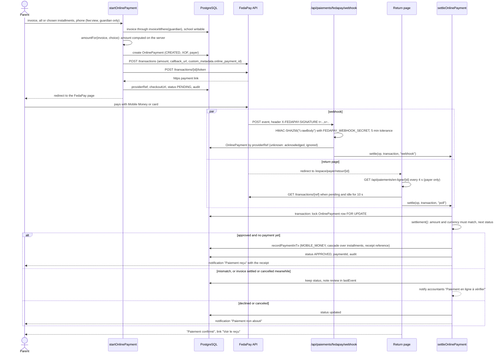

## 6. Payment declaration and confirmation

A parent who paid outside the platform (a Mobile Money transfer to the
school's number, a bank transfer) declares it with the transaction reference
and an optional proof. The server refuses an amount above what is left once
the payments received and the declarations still being checked are counted,
and a reference already declared on the invoice (also enforced by a unique
index). The accountant checks the money arrived, then confirms or refuses.
Confirmation claims the pending declaration and records a payment through
the same function as the cash desk, in one transaction, so a declaration is
confirmed once.

Files: `src/features/online-payment/actions.ts` (`declarePayment`,
`confirmDeclaration`, `rejectDeclaration`),
`src/features/online-payment/schema.ts`, `src/features/payments/record.ts`,
`src/lib/files.ts` (proof upload), page `/espace/frais/declarations`.

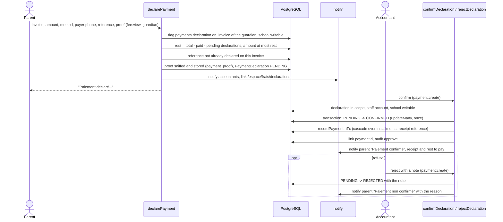

## 7. Document issue and QR verification

Every PDF download (report cards, certificates, attestations, receipts,
invoices, payslips, lists, timetables, statistics, mock exam results) and
every printed view gets a verification code of 10 Crockford base 32
characters, printed with a QR code pointing to `/verifier/<code>`. The PDF
is registered in `IssuedDocument` with the SHA-256 of the exact file sent.
When the school head signed the same content (hash of a canonical JSON of
the document's content), the copy carries the signature images and reuses
the signature's stable code; any change of content (a grade, a name) makes
the next copy unsigned until the head signs again.

The public page shows only the kind of document, the school, the pupil's
initials, the signer and the dates, and lets a visitor compare a PDF in hand
with the registered hash, computed in the browser (the file is never
uploaded). A revoked document is shown as revoked with its reason.

Files: `src/lib/pdf/respond.ts` (`exportPdf`),
`src/features/verification/registry.ts`,
`src/features/verification/reference.ts`,
`src/features/verification/queries.ts`, `src/features/verification/actions.ts`
(`revokeDocument`), `src/features/verification/components/file-check.tsx`,
`src/lib/pdf/print/sheet.tsx` (`issueOnce` for printed views),
`src/app/verifier/[reference]/page.tsx`.

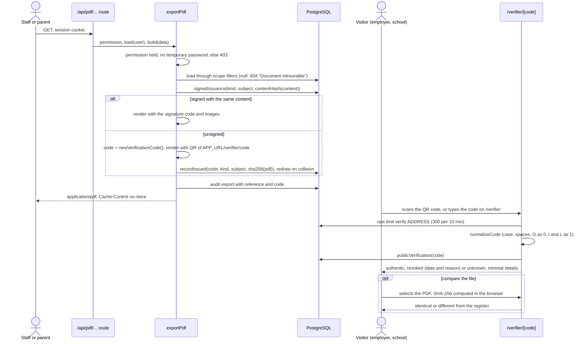

## 8. Transfer between schools with parent consent

The origin school asks, the primary guardian consents, the destination
school accepts and chooses the class. A guardian without an account (no
smartphone, reads little) signs on paper at the school, which then ticks the
consent box itself: the request goes straight to the destination. Only one
transfer per student may be pending. Acceptance moves the enrollment to the
destination class in one transaction and, when the origin chose to share the
school record, grants the destination access to it. The whole module sits
behind the `students.transfers` flag.

Files: `src/features/transfers/actions.ts`, `src/features/transfers/logic.ts`
(`nextStatus`, unit tested), `src/features/transfers/enrollment-move.ts`,
pages under `/espace/transferts`.

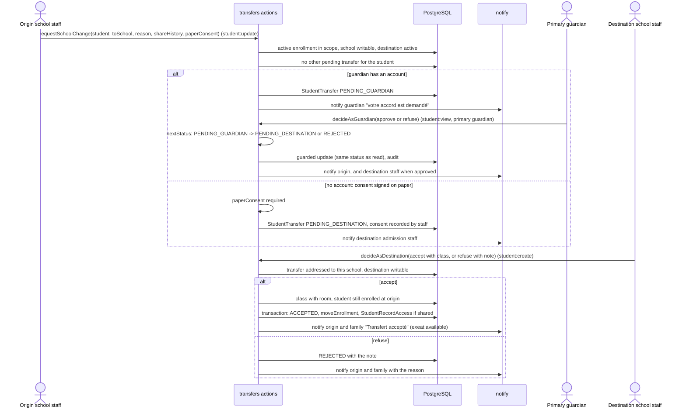

## 9. Mock exam invitation and approval

A school organiser creates a mock exam for an exam level and invites
partner schools of its department that teach the level. Partners accept or
decline. Once at least one partner accepted, the organiser submits it for
approval. The approving level depends on the schools still in the exam
(`approvalLevel`): the circonscription when all are nursery or primary
schools of one commune, the departmental direction (of the right chain) when
all are in one department, the ministry otherwise. An exam created by an
authority imposes participation and is approved at once. Results are entered
from the first day of an approved exam until the organiser closes it; then
families are notified. Behind the `exams.mock` flag.

Files: `src/features/mock-exams/actions.ts`, `src/features/mock-exams/rules.ts`
(`approvalLevel`, `canDecideAt`, `canSubmit`, `resultsOpen`, unit tested),
`src/features/mock-exams/queries.ts`,
`src/app/api/pdf/examens-blancs/[id]/route.ts`.

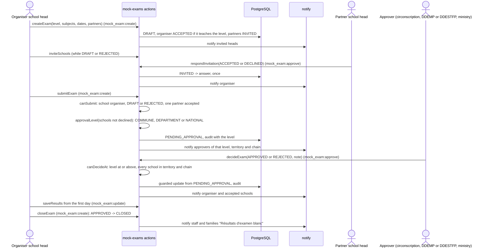

## 10. Translation and voice

**Interface translation.** When a family member picks Fongbe or Yoruba (or
another language enabled in the `languages.translation` flag), the page
sends its French strings to `/api/langues/interface`. The server answers
from the `Translation` cache only, at once. Strings not cached yet are put in
an in-memory queue and translated in the background after the response
(`after()`), 100 per request to api229langues, within the service quota of
five requests per minute shared by every instance through the rate limit
table. The page stays in French for them until a later visit. A string the
service cannot translate is cached as its own French text, so it is not
asked again. Announcements and messages are translated on request
("Traduire en fongbe") through `/api/langues/contenu`, which may wait up to
20 seconds for the quota.

**French voice (Kora).** The browser asks `GET /api/voix` once per page.
When the answer is `{"voice": "Siwis"}`, it cuts the text into parts and
asks `POST /api/voix` for each part while the previous one plays. The server
looks for the clip in the cache (a `FileBlob` named after a hash of the
voice, the pace and the text) and only calls the Python function
`api/kora-tts.py` on a miss; the WAV is checked and stored, then served by
`/api/langues/audio/{id}`. When the function is not configured, fails, or
the device is offline, the browser reads with its own speech synthesis.

**Local language voices.** `/api/langues/voix` translates the French text
(cache first), synthesises each piece with the service once and keeps it as
a clip. On any failure the browser reads the French text itself.

**Public allowlist.** A signed out visitor gets speech only for the texts of
the public pages (landing, sign in, forgotten password), compared by hash
after normalising spaces, and receives clip addresses carrying an HMAC token.
Any other text answers 401, so nobody can spend the quota on arbitrary text.

Files: `src/features/languages/translation-layer.tsx`,
`src/features/languages/guard.ts`, `src/features/languages/service.ts`,
`src/app/api/langues/*/route.ts`, `src/lib/voice/kora.ts` (browser side),
`src/app/api/voix/route.ts`, `src/lib/voice/piper.ts`,
`src/lib/voice/speech-text.ts`, `src/lib/voice/allowlist.ts`,
`src/lib/voice/public-texts.ts`, `src/lib/voice/clip-token.ts`,
`api/kora-tts.py`.

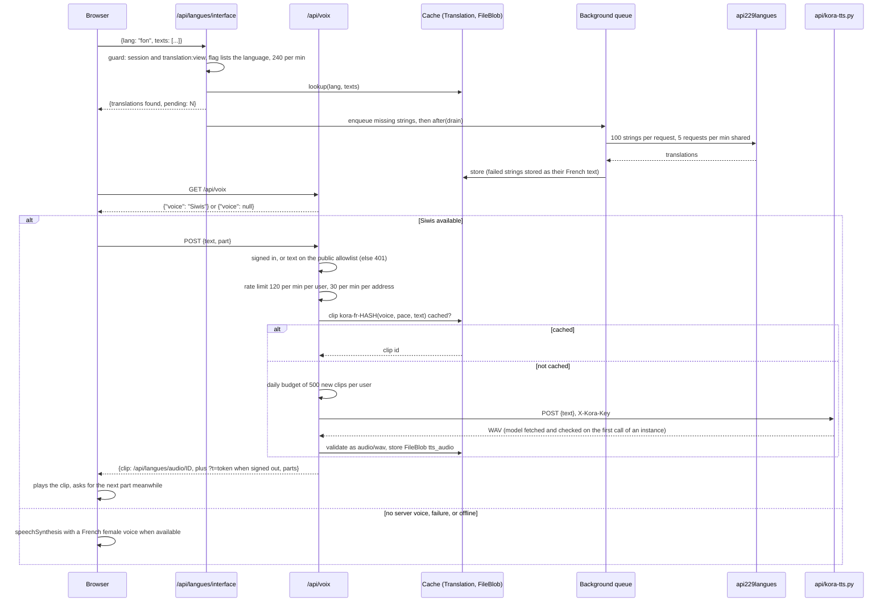

## 11. Voice notes and family pieces

**Voice notes.** A voice note recorded in the browser is posted as a
message. The server checks the conversation belongs to the sender, limits
voice notes to 30 per user per 10 minutes, and stores the recording only if
its first bytes are WebM, Ogg, MP4 audio or WAV and it weighs 2 MB at most.
The declared type is ignored: the stored type is the sniffed one. The file is
served by `/api/files/{id}` only to the participants of the conversation (or
staff of a participating institution). Voice notes need a connection: the
offline queue holds text only.

**Family pieces.** Parents (and students from 16 years old, for their own
non health pieces) send enrollment pieces, absence justifications and medical
certificates from "Pièces et justificatifs". Uploads are limited to 20 per
user per hour and sniffed like any file (PDF, JPEG, PNG, WebP, 3 MB at
most). A medical certificate keeps no free text. Reviewers are school staff
holding `family_document:approve`, or `health_document:approve` for a health
piece. An accepted absence justification marks the absence excused. A health
piece loses its file at the decision, accepted or refused, in the same
transaction: the `FileBlob` is deleted and `fileRemovedAt` set; health files
are never cached, even by the browser.

Files: `src/features/messages/actions.ts` (`sendVoiceNote`),
`src/features/family-documents/actions.ts`,
`src/features/family-documents/rules.ts` (unit tested),
`src/features/family-documents/access.ts`, `src/lib/files.ts`
(`validateUpload`, `sniff`, limits), `src/app/api/files/[id]/route.ts`.

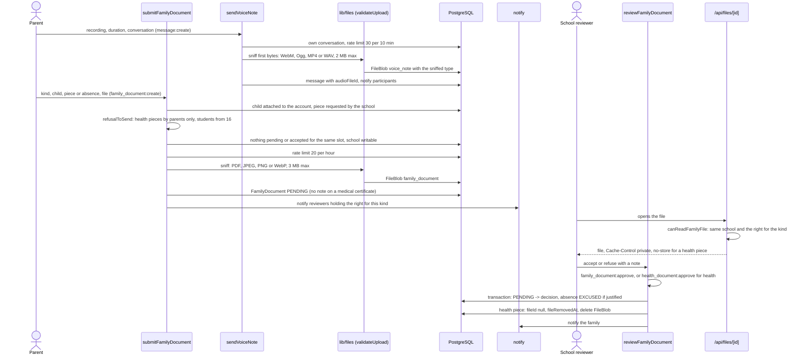
